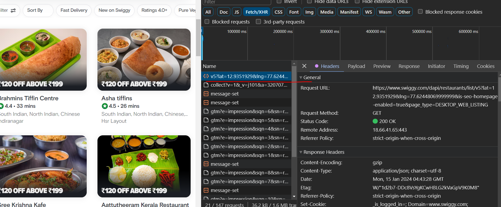

Build wireframe first
divide layout into components


Header
 - Logo
 - Nav Items

Body
 - Search
 - RestaurantContainer
   - ResaurantCard

Footer
  - COpyright
  - Links
  - Address
  - Contact

---

adding styles
```jsx
  const styleCard = {
    backgroundColor : "coral",
    fontSize : "20px"
  }

<div className="res-card" style={styleCard}></div>
<div className="res-card" style={{bakcgoundColor: 'coral' }}></div>
```

Dynamic components with props
like function parameters we can pass props to React Components

we can destructure props
```jsx

const RestaurantCard = (props) => {
  console.log(props);
  return (
    <div className='res-card'>
      <h3>{props.resName}</h3>
      <h4>{props.cuisine}</h4>
    
    </div>
  );
};

const RestaurantCard = (props) => {
  const {resName, cuisine} = props;
  return (
    <div className='res-card'>
      <h3>{resName}</h3>
      <h4>{cuisine}</h4>
    
    </div>
  );
};

const RestaurantCard = ({resName, cuisine}) => {}

```

Right click and open in new tab to view the cards api, use json viewer extension , swiggy uses config


**Config Driven UI**
based on api data, UI loads different data for different locations

```jsx

const Header = () => {
  return (
    <div className='header'>
      <div className='logo-container'>
        
      </div>
      <div className='nav-items'>
        <ul>
          <li>Home</li>
          <li>About Us</li>
          <li>Contact Us</li>
          <li>Cart</li>
        </ul>
      </div>
    </div>
  );
};

const RestaurantCard = (props) => {
  console.log(props);
  return (
    <div className='res-card'>
      
      <h3>{props.resName}</h3>
      <h4>{props.cuisine}</h4>
      <p>4.4 stars</p>
      <p>38 minutes</p>
    </div>
  );
};

const Body = () => {
  return (
    <div className='body'>
      <div className='search'></div>
      <div className='res-container'>
        <RestaurantCard 
          resName="Meghana Foods"
          cuisine="Biryani, North indian"/>
        <RestaurantCard 
          resName="KFC"
          cuisine="fast food, burger"/>
       
      </div>
    </div>
  );
};

const AppLayout = () => {
  return (
    <div className='app'>
      <Header />
      <Body />
    </div>
  );
};

const root = ReactDOM.createRoot(document.getElementById("root"));

root.render(<AppLayout />);
```


Passing prop data 

```js

const resObj = {
  "info": {
    "id": "273752",
    "name": "Brahmins Tiffin Centre",
    "cloudinaryImageId": "qmwj1vbbjljfp2saegsk",
    "locality": "New Thipasandra",
    "areaName": "Indiranagar",
    "costForTwo": "₹150 for two",
    "cuisines": [
      "South Indian",
      "North Indian",
      "Chinese"
    ],
    "avgRating": 4.4,
    "veg": true,
    "avgRatingString": "4.4",
    "isOpen": true
  }
}

const RestaurantCard = ({resData}) => {
  console.log(resData.info);
  const {name, cuisines, avgRating, areaName, cloudinaryImageId} = resData.info;

  return (
    <div className='res-card'>
      
      <h3>{name}</h3>
      <h4>{cuisines.join(", ")}</h4>
      <p>{avgRating} stars</p>
      <p>{areaName}</p>
    </div>
  );
};
```

Optional Chainig
`obj?.data`
https://developer.mozilla.org/en-US/docs/Web/JavaScript/Reference/Operators/Optional_chaining


```jsx
const resList =[{}, {}];

resList.map(restaurant => (
    <RestaurantCard 
      key={restaurant.info.id} 
      resData={restaurant}
    />
  ))
```

if there is no key, then if a new item is added in the list object, react will load all the cards

if key is given, only the new item will be rendered/added to the existing component UI tree.

Note : add a key when we map over the component
Dont use array index as key, it is anti-pattern


